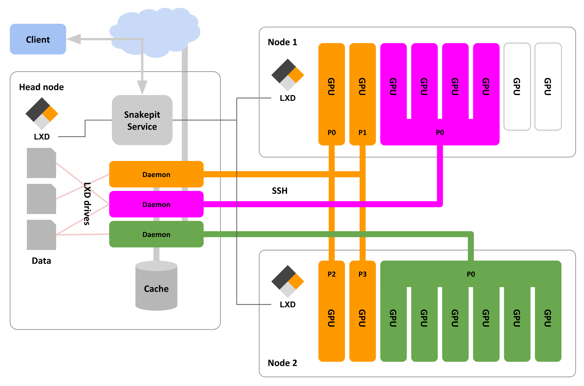

# Snakepit

Snakepit is a machine learning job scheduler with the following features:
- Scheduling of concurrent machine learning jobs
- Support for multi-machine and multi-GPU jobs
- Job's tasks running in interconnected LXD containers with "root" access
- Built-in user and group management
- Jobs get access to training data according to user's access rights
- Remote access through command line client over HTTP API
- Remote data access through FUSE mounts (even during training)

__The Snakepit service has not gone through an in-depth security-audit yet.
Therefore you should not offer unknown/random users access to your service.__

## Getting Started

This following instructions are intended for administrative Snakepit users
who want to configure and run an own Snakepit cluster.

If you are a Snakepit end-user and just want to know how to run jobs
on an existing Snakepit cluster,
you should follow the [snakepit-client user-guide](https://github.com/mozilla/snakepit-client/)

### Big picture



- The typical setup for a Snakepit machine learning cluster is to have a so called __head node__ machine and a bunch of __worker node__ machines. 
- The head node is typically hosting the __Snakepit service__ and has/provides access to the outer world. In our scenario it also contains all the (training) data.
- The worker nodes are connected to the head node through a (high speed) local network and are typically equipped with __GPUs__. You can also run a one-machine setup (e.g. for testing or development) where head node and worker nodes are essentially on one machine.

- A job is started on the user's computer through snakepit's command-line client from within a git repository checkout.
- The client sends all relevant information of the checkout (address of repository, hash, diff, ...) through Snakepit's __HTTP API__ to the Snakepit service.
- The snakepit service now starts a so called __pit__ (like a "pod" in Kubernetes).
- A pit (and therefore a job) consists of __processes__ and associated data (checkout of job repository).
- Each process is represented by its own __LXD container__ which is a para-virtualized environment using Linux-namespaces (think of a lightweight virtual machine).
- For each job (pit) there is exactly one so called __daemon process__ which will run on the head-node. Its responsibility is to provide data to the other processes of the pit.
- The so called __worker processes__ of a pit can access the provided data through __sshfs__ mounts to the daemon process.
- Each worker process executes the same __.compute__ script of the job (which is typically taken from the job's repository checkout).
- All worker processes are running on worker nodes and each of them has exclusive access to its allocated sub-set of resources on it (typically GPUs).

### Prerequisites

* At least one machine with at least one GPU (at the moment there is only support for Nvidia GPUs)
* Latest Nvidia drivers for each GPU
* [LXD](https://linuxcontainers.org/lxd/) (3.0+) installed on each machine
* A front-end web-server of your choice on the main machine (optional but recommended)
* git

### Configuring LXD

Before Snakepit can get installed, LXD has to be configured on 
all involved machines (if not already done).
So on each machine of your cluster you have to call 
```
$ sudo lxd init
```
During the following questionnaire you'll be asked, if you want to create a new storage pool.
It is highly recommended to create a copy-on-write one on base of `zfs` or `btrfs`.
Each machine's storage pool should have at least 10 GB of space.
On the following question you should respond with `yes`:
```
Would you like LXD to be available over the network (yes/no) [default=no]? yes
```
You'll be asked to set a password which will be required later during Snakepit's setup.

__After Snakepit is configured and/or the machine got added, you should unset it again:__
```
$ lxc config unset core.trust_password
```

### Installing

All the following steps are only to be done on the head node. 
First you have do create a Snakepit user:
```
$ sudo adduser snakepit
[...]
```

First clone the Snakepit project.
From within Snakepit's project root, you can now call:
```
/path/to/snakepit/clone$ sudo bin/prepare-directories.sh snakepit /snakepit
```
This will create the required data directory structure in `/snakepit` owned by user `snakepit`.
This directory is from now on called "data-root".
You could also pick a different path.

Now it's time to prepare the snakepit service:
```
/path/to/snakepit/clone$ sudo bin/prepare-service.sh /snakepit /path/to/snakepit/clone
```
This will create the `snakepit` LXD container and bind the data-root to its internal directory `/data`
and `/path/to/snakepit/clone` to its internal directory `/code`. If you omit `/path/to/snakepit/clone`,
the script will clone the project another time within the container into `/code`.
The script is also automatically mapping the outer directory-owner of
the data-root (in our case user `snakepit`) to its inner `root` user.

If you get a line with "Problem accessing https://...:8443", you have to figure out the URL for
the local LXD service and run the provided command.
The `bin/prepare-service.sh` script looks for the `lxdbr0` bridge network adapter (this is a default one in LXD).
If not existing, it will create and attach it to the snakepit service container as `eth0`.
The following commands will help you figuring out the service address:
* `sudo lxc exec snakepit -- ip addr` lists all interfaces of the snakepit service container and their IP addresses
* `sudo lxc network list` shows all LXD networks
* `sudo lxc network show <network-name>` shows details and addresses of one network
* `sudo lxc exec snakepit -- curl -k https://<address>:8443/1.0` tests an address from inside the snakepit service container

Next step is to create the worker and daemon LXD container images:
```
/path/to/snakepit/clone$ sudo bin/prepare-images.sh
```
This is a highly automated process and should not require any interaction.

After this you have the chance to install any required software into the worker image:
```
/path/to/snakepit/clone$ sudo lxc exec snakepit-worker -- bash
root@snakepit-worker:/root# apt install some-requirement
[...]
root@snakepit-worker:/root# exit
```

Before the images can be used, you have to publish them:
```
/path/to/snakepit/clone$ sudo bin/publish-images.sh
```

### Access to Snakepit service

The snakepit service itself only provides unencrypted HTTP access. 
Therefore it is highly recommended to run snakepit behind a front-end web server with HTTPS configuration.
The front-end server has to forward requests to port 80 of the address of the `eth0` interface of 
the snakepit service (`sudo lxc exec snakepit -- ip addr`).
You can check connectivity through
```
$ curl http://<snakepit-service-address>/hello
Here I am
```

For clients to be able to connect to the service, they have to have access to a so called `.pitconnect.txt` file.
Its first line has to be the (outer) service URL without trailing slash.
If you have/want to go for a self-signed HTTPS certificate of your front-end server,
you can add the certificate content under that first line in the `.pitconnect.txt` file.
The `.pitconnect.txt` is considered public and in case of a self-signed certificate
it is to be distributed to users on a separate channel (like email).
The snakepit client will only accept valid certificates or the one provided through the `.pitconnect.txt` file.

### First time use

For the following steps you have to first [install the snakepit client](https://github.com/mozilla/snakepit-client/#installation).

Within a directory that contains the `.pitconnect.txt` file (from the last step),
you can now test your configuration end-to-end:
```
$ pit status
No user info found. Seems like a new user or first time login from this machine.
Please enter an existing or new username: tilman
Found no user of that name.
Do you want to register this usename (yes|no)? yes
Full name: Tilman Kamp
E-Mail address: ...
New password: ************
Reinput a same one to confirm it: ************
   JOB   S SINCE        UC% UM% USER       TITLE                RESOURCE 
```

As you are the first user, Snakepit automatically granted you admin rights:
```
$ pit show me
Username:         tilman
Full name:        Tilman Kamp
E-Mail address:   ...
Is administrator: yes
```

### Adding nodes

Before one can run jobs on a worker node, the node has to be added to the snakepit service:
```
$ pit add node:n0 endpoint=https://...:8443
LXD endpoint password: **********
```
Here we gave the node the short-name "n0" and its LXD API URL as endpoint.
The password is the one that was specified during LXD configuration of the node.
If the node has been added successfully, this password should be unset (see LXD config section).

If the node had been added successfully, you should take a look at the node's GPUs (also called resources):
```
$ pit show node:n0
Node name: n0
State:     ONLINE
Resources: 
  0: "GeForce GTX 1070" (cuda 0)
  1: "GeForce GTX 1070" (cuda 1)
```

Time to define a model name alias:
```
$ pit add alias:gtx1070 name="GeForce GTX 1070"
$ pit show node:n0
Node name: n0
State:     ONLINE
Resources: 
  0: "GeForce GTX 1070" aka "gtx1070" (cuda 0)
  1: "GeForce GTX 1070" aka "gtx1070" (cuda 1)
```

Time to run a first test job:
```
$ pit run "First light" [2:gtx1070] -d 'cat /proc/driver/nvidia/gpus/**/*' -l
Job number: 190
Remote:     origin <https://github.com/...>
Hash:       ...
Diff LoC:   0
Resources:  "[2:gtx1070]"

[2018-12-14 17:04:58] [daemon] Pit daemon started
[2018-12-14 17:05:01] [worker 0] Worker 0 started
[2018-12-14 17:05:01] [worker 0] Model: 		 GeForce GTX 1070
[2018-12-14 17:05:01] [worker 0] IRQ:   		 139
[2018-12-14 17:05:01] [worker 0] GPU UUID: 	 ...
[2018-12-14 17:05:01] [worker 0] Video BIOS: 	 86.04.26.00.80
[2018-12-14 17:05:01] [worker 0] Bus Type: 	 PCIe
[2018-12-14 17:05:01] [worker 0] DMA Size: 	 47 bits
[2018-12-14 17:05:01] [worker 0] DMA Mask: 	 0x7fffffffffff
[2018-12-14 17:05:01] [worker 0] Bus Location: 	 0000:01:00.0
[2018-12-14 17:05:01] [worker 0] Device Minor: 	 0
[2018-12-14 17:05:01] [worker 0] Blacklisted:	 No
[2018-12-14 17:05:01] [worker 0] Binary: ""
[2018-12-14 17:05:01] [worker 0] Model: 		 GeForce GTX 1070
[2018-12-14 17:05:01] [worker 0] IRQ:   		 142
[2018-12-14 17:05:01] [worker 0] GPU UUID: 	 ...
[2018-12-14 17:05:01] [worker 0] Video BIOS: 	 86.04.26.00.80
[2018-12-14 17:05:01] [worker 0] Bus Type: 	 PCIe
[2018-12-14 17:05:01] [worker 0] DMA Size: 	 47 bits
[2018-12-14 17:05:01] [worker 0] DMA Mask: 	 0x7fffffffffff
[2018-12-14 17:05:01] [worker 0] Bus Location: 	 0000:02:00.0
[2018-12-14 17:05:01] [worker 0] Device Minor: 	 1
[2018-12-14 17:05:01] [worker 0] Blacklisted:	 No
[2018-12-14 17:05:01] [worker 0] Binary: ""
[2018-12-14 17:05:01] [worker 0] Worker 0 ended with exit code 0
[2018-12-14 17:05:01] [daemon] Worker 0 requested stop. Stopping pit...
```

__Et voilà - you got your first snakepit cluster.__
For further understanding of jobs and their runtime environment,
refer to the [snakepit-client user-guide](https://github.com/mozilla/snakepit-client/).

## Configuration

The configuration of the snakepit service is read from a YAML file at
`/etc/snakepit/snakepit.conf` inside the snakepit container.
You can edit it through vim:
```
$ sudo lxc exec snakepit -- vim /etc/snakepit/snakepit.conf
$ sudo lxc exec snakepit -- systemctl restart snakepit
```

Possible configuration values are:
- interface:         Interface(s) to bind the service to - default 0.0.0.0 (all)
- port:              Port of the service - default 80
- logLevel:          How verbose the service logs to system log (0=DEBUG, 1=INFO, 2=ERROR) - default 1
- debugHttp:         Debug HTTP activity (true/false) - default false
- debugJobFS:        Debug remote mount activity (true/false) - default false
- tokenSecret:       Path to a file containing crypto-secret for access tokens
- tokenTTL:          Lifetime of access tokens before users have to re-authenticate (time-value) - default 1d
- hashRounds:        How many hash rounds access tokens are going through - default 10
- endpoint:          Head node's LXD HTTPS API endpoint
- clientKey:         Path to cryptographic key file for accessing head node's LXD endpoint
- clientCert:        Path to cryptographic certificate file for accessing head node's LXD endpoint
- lxdTimeout:        HTTP timeout in seconds for all LXD API access (time-value) - default 10s
- lxdBridge:         Bridge name of the network bridge that each container should connect its first NIC with - default lxdbr0
- lxdDomain:         Domain name for all containers - default lxd
- containerTimeout:  Timeout for LXD container state change - default 30s
- pollInterval:      Polling interval for checking LXD container states in ms - default 1000
- maxParallelPrep:   Maximum number of parallel job preparations - default 2
- maxPrepDuration:   Timeout for preparation phase (time-value) - default 1h
- maxStartDuration:  Timeout for start phase (time-value) - default 5m
- mountRoot:         Path to data-root on head-node - default /snakepit
- queryLimit:        Maximum number of returned list entries per user query

## Managing data

There are four different data domains in Snakepit.
All of them are represented by certain sub-directories within the data-root directory.
Jobs have the same read/write rights as their owning users.

* Shared data: `<data-root>/shared/` - Files in this directory are read-only for everyone and considered public.
    Only users with direct access to the head-node can change its contents.
* Group data: `<data-root>/groups/<group-name>/` - Admins and all members of the given group have read/write access to all contents.
* User data: `<data-root>/home/<user-name>/` - Admins and the given user have read-write access.
* Job data: `<data-root>/pits/<job-number>/` - Admins, the owning user and group members of groups specified in the "groups" property of the job have read-access. Only the running job is allowed to write data.

`<data-root>/cache/` contains all cached git clones.

`<data-root>/db.json` is the database of the snakepit service.

## Troubleshooting

The snakepit service is running as a regular systemd service (named "snakepit") inside the snakepit container.
So you can control it through `systemctl` and monitor it through `journalctl`.

In case of a tough problem you can also stop the systemd service and run snakepit manually:
```
$ sudo lxc exec snakepit -- bash
root@snakepit:~# systemctl stop snakepit
root@snakepit:~# cd /code
root@snakepit:/code# npm start

> snakepit@0.0.1 start /code
> node src/service.js

get https://...:8443/1.0 
state head 1
state n0 1
get https://...:8443/1.0/containers 
pitReport []
'Snakepit service running on 0.0.0.0:80'
[...]
```
With configuration `logLevel: 0` this should give you a good start for figuring out what's going on.

To get a better understanding of how a running job/pit looks like from LXD's perspective,
you could list the running containers:

```
$ sudo lxc list
+---------------+---------+-----------------------+--------------------------+------------+-----------+
|     NAME      |  STATE  |         IPV4          |           IPV6           |    TYPE    | SNAPSHOTS |
+---------------+---------+-----------------------+--------------------------+------------+-----------+
| snakepit      | RUNNING | 192.168.... (eth0)    | fd42:...          (eth0) | PERSISTENT |           |
+---------------+---------+-----------------------+--------------------------+------------+-----------+
| sp-head-191-d | RUNNING | 10.125.... (eth0)     | fd42:...          (eth0) | PERSISTENT |           |
+---------------+---------+-----------------------+--------------------------+------------+-----------+
| sp-n0-191-0   | RUNNING | 10.125.... (eth0)     | fd42:...          (eth0) | PERSISTENT |           |
+---------------+---------+-----------------------+--------------------------+------------+-----------+
```

As you can see, a Snakepit container name (with the exception of Snakepit's service container) consists of the following parts (in given order):
* "sp-": The common prefix allows using LXD for other purposes than Snakepit as long as containers are prefixed differently.
* "&lt;node-name&gt;-": The name of the node the container runs on. This is required in case of double-adding a node for single-node setups and demos (like in this case).
* "&lt;pit-number&gt;-": The pit number which is also the job number.
* "&lt;process-specifier&gt;": "d" in case of the pit's daemon and the process/worker index in case of a worker process.

## Help

1. [**IRC**](https://wiki.mozilla.org/IRC) - You can contact us on the `#machinelearning` channel on [Mozilla IRC](https://wiki.mozilla.org/IRC); people there can try to answer/help

2. [**Issues**](https://github.com/mozilla/snakepit/issues) - If you think you ran into a serious problem, feel free to open an issue in our repo.
